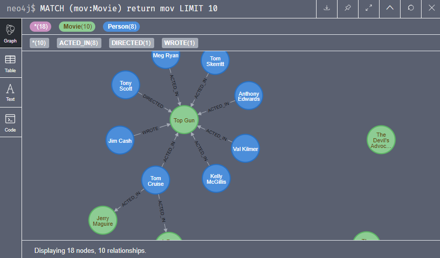

# Experiment Lab 🧪

## Objective

<i> * First contact with the graph-oriented database integrated with Nodejs! </i>

## Features

<i> * Neo4j -> NoSQL database</i>

<i> * HTML -> Hypertext Markup Language </i>

## Get started

<i> * Execute: <b>node app.js (located at the root of the project)</b></i>

